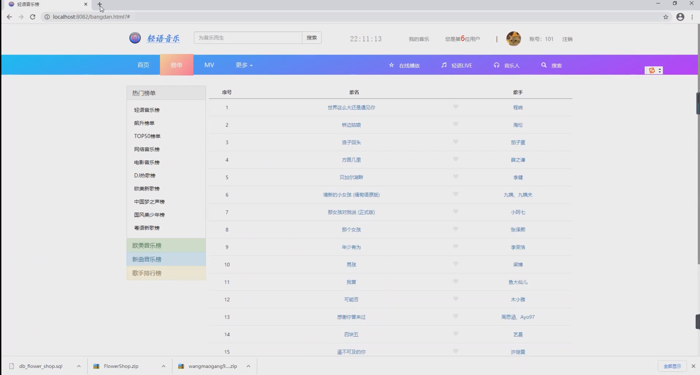
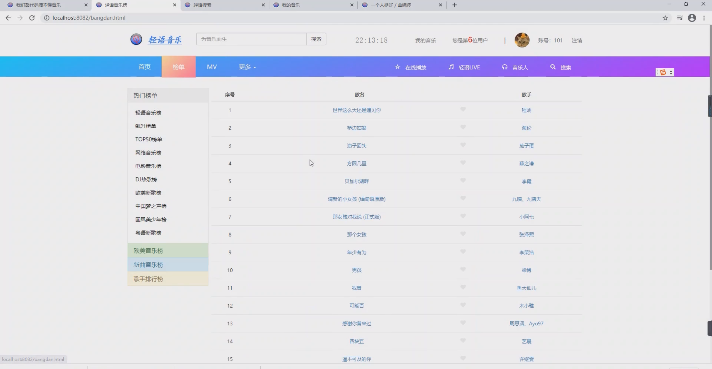

基于Springboot框架实现的轻语音乐网
=
###  完整代码获取地址：从戎源码网 ([https://armycodes.com/](https://armycodes.com/))
###  作者微信：19941326836  QQ：952045282 
###  承接计算机毕业设计、Java毕业设计、Python毕业设计、深度学习、机器学习
###  选题+开题报告+任务书+程序定制+安装调试+论文+答辩ppt 一条龙服务
###  毕业设计所有选题地址:(https://github.com/3212618475/allProject)

一、项目介绍
---
基于Spring Boot框架实现的轻语音乐网，系统包含两种角色：管理员、用户,系统分为前台和后台两大模块，主要功能如下。
### 功能：
用户管理模块：用户登录、用户注册、修改密码
榜单列表模块：动态地从数据库中获取歌曲的链接和数据在榜单中显示
歌曲搜索模块：在首页的搜索框中可以输入关键字进行歌曲的模糊搜索
歌曲收藏模块：在榜单列表中或搜索页面中可以点击歌曲进行收藏
我的音乐模块：收藏的歌曲会被添加到我的音乐列表中，在我的音乐列表中也可以对歌曲进行删除操作
音乐播放器模块：在榜单、搜索页面和我的音乐列表等地方点击歌曲可以跳转到播放页面进行播放。播放页面显示
播放进度条，删除歌曲，暂停等操作。播放页面背景为模糊背景，根据歌手的专辑图片自动变化

二、项目技术
---
JSP +SpringBoot + MyBatis + html+ css + JavaScript +JQuery+Ajax+Bootstrap+maven等等

三、运行环境
---
操作系统：Windows、macOS都可以
JDK版本：JDK1.8以上都可以
开发工具：IDEA、Ecplise、Myecplise都可以
数据库: MySQL5.7以上都可以
Tomcat：任意版本都可以
Maven：任意版本都可以

四、项目截图
---
使用截图

